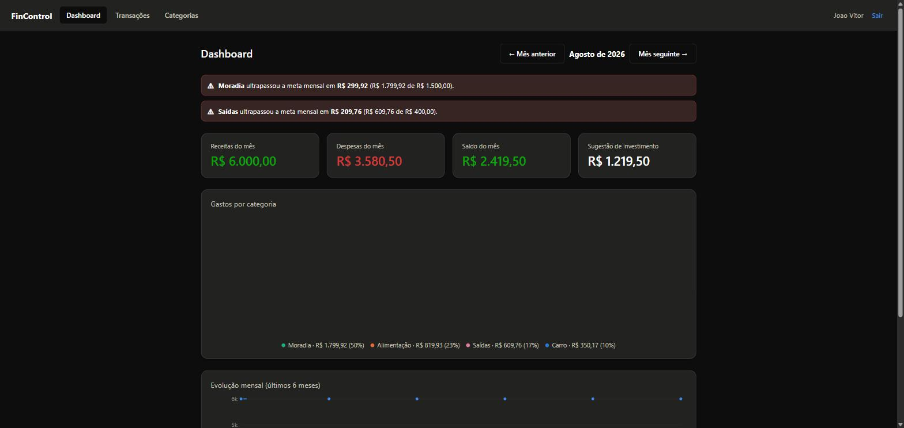
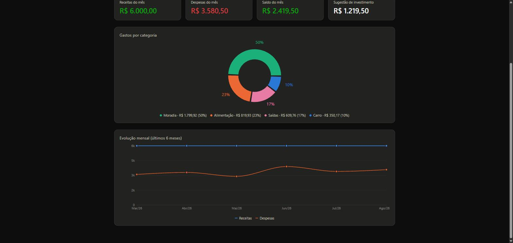
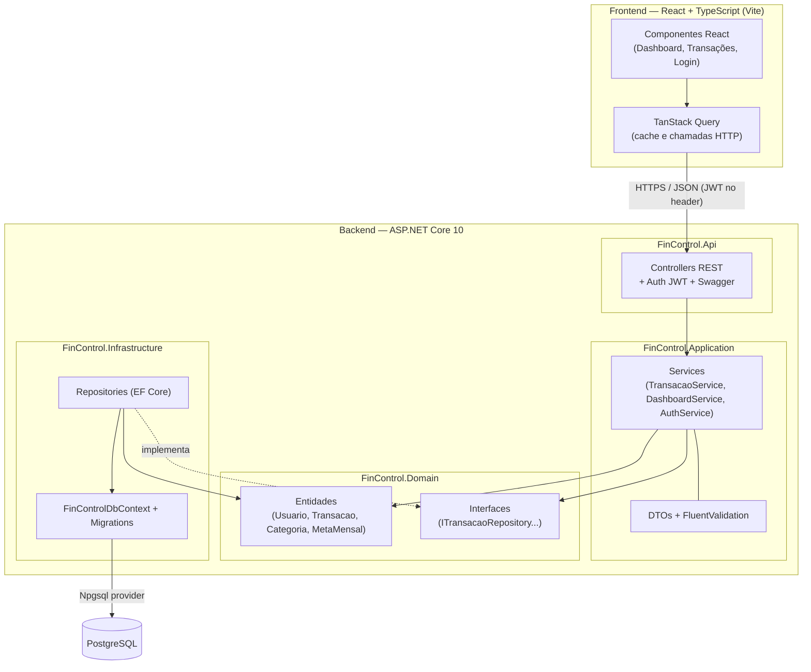

# FinControl

Sistema web de controle financeiro pessoal: categorização de gastos, alertas visuais de estouro de meta e uma calculadora de quanto dá pra investir no mês, com base na renda, nos gastos e numa reserva de segurança.

Projeto de portfólio full stack construído para demonstrar o stack .NET moderno (C#/.NET 10, ASP.NET Core, EF Core, ASP.NET Identity + JWT) junto com um frontend React/TypeScript, seguindo Clean Architecture no backend.




## Funcionalidades

- Cadastro e login com JWT (ASP.NET Core Identity)
- CRUD de categorias (com cor personalizada) e transações (receita/despesa)
- Metas mensais por categoria, com alerta visual quando o gasto ultrapassa o limite
- Dashboard com resumo do mês, gráfico de pizza por categoria e linha de evolução mensal (Receitas x Despesas)
- Sugestão de investimento: `renda − gastos − reserva de segurança = quanto investir`
- Mensagens de erro e validação em português (inclusive as nativas do ASP.NET Identity e do FluentValidation)

## Stack

| Camada | Tecnologias |
|---|---|
| Frontend | React 19, TypeScript, Vite, TanStack Query, React Router, React Hook Form + Zod, Recharts |
| Backend | C# / .NET 10, ASP.NET Core Web API, ASP.NET Core Identity, JWT Bearer |
| Persistência | PostgreSQL via EF Core / Npgsql |
| Testes | xUnit + Moq (services da camada Application) |
| Infra | Docker Compose (API + PostgreSQL) |

## Arquitetura

Clean Architecture simplificada em 4 projetos — `Domain` não depende de nada; `Infrastructure` implementa as interfaces definidas em `Domain`; `Application` orquestra tudo por inversão de dependência; `Api` só expõe HTTP.



Mais diagramas (DER, sequência) em [`docs/`](docs/).

## Como rodar localmente

### Opção 1 — Docker Compose (recomendado)

Sobe a API e o PostgreSQL juntos; a API aplica as migrations automaticamente ao iniciar.

```bash
cp .env.example .env   # ajuste os valores se quiser (senha do banco, chave JWT etc.)
docker compose up --build
```

- API: `http://localhost:5106` (Swagger em `/swagger`)
- PostgreSQL: `localhost:5432`

Depois, rode o frontend separadamente (veja abaixo).

### Opção 2 — Manual

**Pré-requisitos:** .NET SDK 10, Node.js 20+, PostgreSQL rodando localmente.

```bash
# 1. Banco de dados
# Ajuste FinControl.Api/appsettings.json (ConnectionStrings:DefaultConnection) se necessário

# 2. Backend
dotnet tool install --global dotnet-ef   # se ainda não tiver
dotnet ef database update --project FinControl.Infrastructure --startup-project FinControl.Api
dotnet run --project FinControl.Api

# 3. Frontend (em outro terminal)
cd frontend
cp .env.example .env
npm install
npm run dev
```

- Frontend: `http://localhost:5173`
- API: `http://localhost:5106/swagger`

## Testes

```bash
dotnet test
```

Cobre os services da camada `Application` (`CategoriaService`, `TransacaoService`, `DashboardService`, `AuthService`) com repositórios mockados via Moq — inclui os cálculos do dashboard (totais, estouro de meta, sugestão de investimento) e as checagens de posse (um usuário não pode acessar categoria/transação de outro).

## Variáveis de ambiente

| Variável | Onde | Descrição |
|---|---|---|
| `ConnectionStrings__DefaultConnection` | API | String de conexão do PostgreSQL |
| `Jwt__Key` / `Jwt__Issuer` / `Jwt__Audience` / `Jwt__ExpirationMinutes` | API | Configuração do token JWT |
| `FrontendOrigins__0` | API | Origem liberada no CORS |
| `VITE_API_URL` | Frontend | URL base da API |

Veja `.env.example` (raiz, para o Docker Compose) e `frontend/.env` (para o Vite).

## Deploy

Não incluído neste repositório (exige contas/credenciais próprias), mas o caminho recomendado:

- **API + PostgreSQL:** [Render](https://render.com) ou [Railway](https://railway.app) — ambos sobem a partir do `Dockerfile` em `FinControl.Api/` e oferecem PostgreSQL gerenciado; configure as mesmas variáveis de ambiente listadas acima (a `Jwt__Key` **precisa** ser trocada por um segredo de produção).
- **Frontend:** [Vercel](https://vercel.com), apontando para a pasta `frontend/` com `VITE_API_URL` configurada para a URL pública da API.

## Estrutura do repositório

```
FinControl.sln / .slnx
├── FinControl.Api              → Controllers, middlewares, Program.cs, Swagger
├── FinControl.Application      → Services, DTOs, FluentValidation, JWT/Identity
├── FinControl.Domain           → Entidades, enums, interfaces
├── FinControl.Infrastructure   → EF Core, DbContext, Repositories, Migrations
├── FinControl.Application.Tests → Testes xUnit
├── frontend/                   → React + TypeScript (Vite)
├── docs/                       → DDL, diagramas de arquitetura/DER/sequência
├── docker-compose.yml
└── .env.example
```
